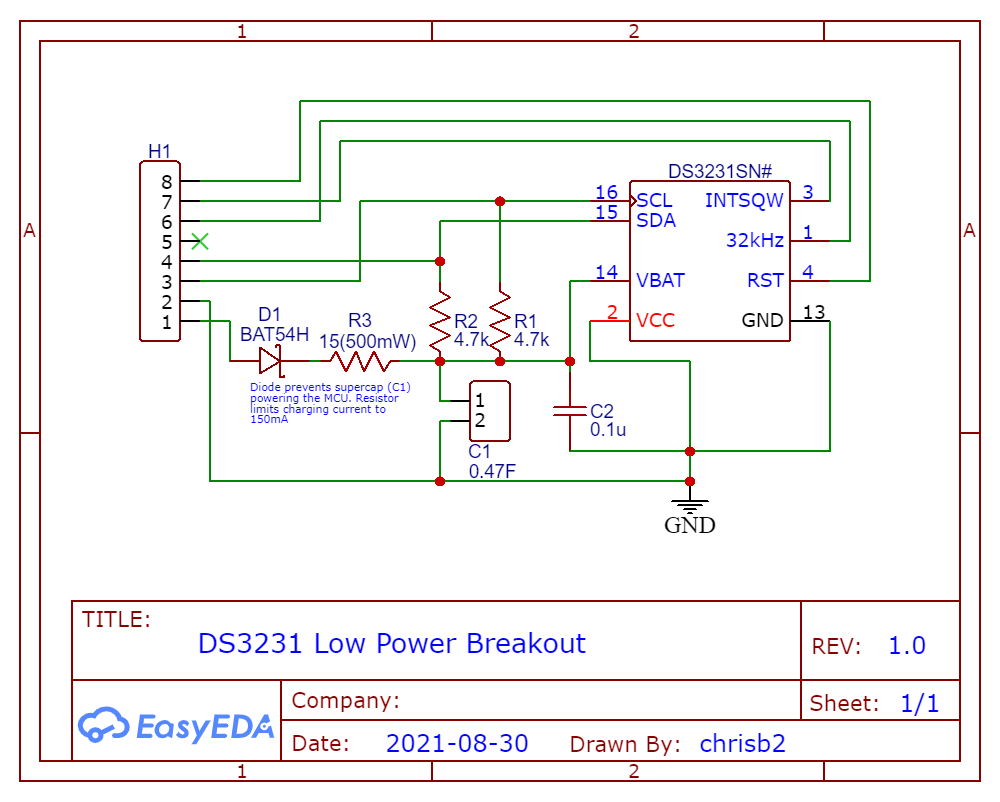

# Low Current RTC Breakout With Super Capacitor Backup

This breakout is based on the [DS3231](docs/DS3231.pdf) RTC from Maxim Integrated and a [FT0H474ZF](docs/FT0H474ZF.pdf) 0.47F super capacitor from Kemet for backup power.

The design powers the DS3231 via the Vbat input rather than Vcc, this results in a current consumption of ~3uA, with spikes to 575uA every 65 seconds when temperature conversion occurs (see p3 of the data sheet).

## Design Information

* The schematic shows a DS3231SN which operates accurately below freezing, but the DS3131S can be used if the device is used at room temperature.
* The [BAT54H](docs/BAT54H.pdf) Schottky diode prevents the super capacitor from powering the connected MCU. It has a forward current of 200mA to allow for the current to charge the super capacitor.
* R3 has been chosen to limit the super capacitor charge current to ~150mA based on Vbat being 3.3V. If the input voltage is higher a correspondingly larger value will be required to maintain the maximum current of 150mA.

## PCB

## Breakout
